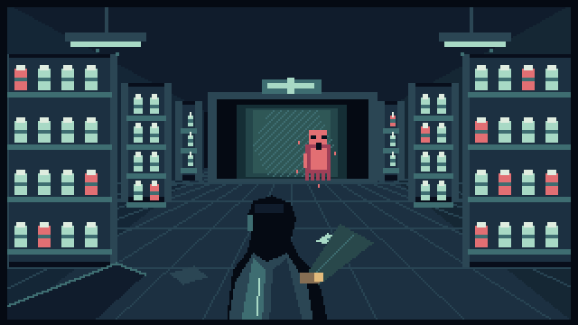

# AFTERHOURS: The Tenth Prescription

**Ten wards. Thirty names. One light left on.**

The pharmacy closed ten years ago. Tonight, its lights came back on. Enter a haunted pharmacy, recover the names your sister refused to lose, and decide what the building remembers.

[Play AFTERHOURS](https://afterhours-prescription.web.app) · [Source](https://github.com/shi1720/afterhours-tenth-prescription)

[Official gameplay video](https://youtu.be/L6kt6Z9vEp4) (published publicly). The 67-second montage uses a generic synthetic narrator, not Shivam Gupta's voice.



## The night shift

Explore ten authored rooms with different routes and escalating threats. Each holds three sealed records. Your light pulse reveals names and briefly stops nearby shadows, but its sound can attract a distant pursuer. Stop to recover a record, choose where to hide, and make a careful return to the dispensing hatch.

A receipt printer that wakes without power. A ticket display stuck on forty-one. A phone ringing down a corridor. Every room has its own environmental setpiece, arrival sound and recovered memory. The final prescription leads to two story choices. Proximity heartbeats, shelf creaks, pursuit cues and brief pixel apparitions build tension as shadows close in. Gentle mode softens the sounds and removes sudden faces; the animation setting also disables visual jump scares.

## Controls

| Action | Keyboard | Touch |
| --- | --- | --- |
| Move | WASD or arrow keys | Direction pad |
| Sneak | Hold Shift | Sneak control |
| Reveal records and stun nearby shadows | Space | Pulse |
| Recover a name or use an object | E | Use |
| Pause | Escape | Pause |

On a phone or tablet, turn the device to landscape and use the controls around the game. Click or tap inside the player if keyboard focus is elsewhere. The first-launch field guide explains the night shift and can be replayed from the title screen.

A pulse costs **24 charge**, stuns nearby shadows for **2.6 seconds**, and has a **4.2-second cooldown**. Press Use beside a revealed record, then remain still for its **0.9-second recovery**. A recovered name returns some charge. Collect all three records and use the hatch to descend.

Cabinets break pursuit. The charging station restores charge and some resolve, but its hum draws shadows. Alarms, timed darkness and pulsing spills change when a route is safe. Late pursuers make cover important.

## Your progress

Create a local profile and continue from completed wards. Your profile, archive, unlocked rooms, preferences and ending stay on this device. The game has no password, online authentication, subscription or cloud synchronization.

Browser saves belong to the current browser and site address. Clearing site data, private browsing, storage eviction, changing browsers or switching devices can remove or separate progress. Moving from the previous GitHub Pages address to Firebase does not transfer an existing save automatically.

## Settings and content

The interface is English. Settings include volume, gentler difficulty, high visibility and atmospheric animation controls. Visual cues communicate objectives and danger, so headphones are optional. The fictional story includes darkness, spectral pursuit and peril. It contains no medication advice or real patient information.

## Run from source

Use Godot 4.5 with matching export templates. Open `project.godot` and run the project with F5. The Compatibility renderer supports the web export. Gameplay needs no API keys, account server or paid inference service.

```sh
godot --path . --editor
godot --path .
```

Run the native integration suite after importing assets:

```sh
godot --headless --path . --editor --import --quit
godot --headless --path . --script tests/test_game.gd
```

See [release checks](docs/RELEASE_CHECKLIST.md) for the current verification boundary. The current native suite passes 9,057 assertions. Browser evidence and remaining device checks are recorded separately in the checklist.

## Build and deploy

For all configured exports, set `GODOT_BIN` if Godot is not on PATH and run:

```sh
GODOT_BIN=/path/to/godot tools/build.sh
```

For a local web preview, export the Web preset to `export/web/index.html`, copy the shell artwork and serve over HTTP:

```sh
mkdir -p export/web/assets
godot --headless --path . --export-release Web export/web/index.html
cp assets/title_art.png export/web/assets/title_art.png
python3 -m http.server 8080 --directory export/web
```

Open `http://localhost:8080`. Opening the exported HTML as a file is unsupported. Keep the HTML, JavaScript, WASM and PCK files together. The Web preset uses a single-threaded build for ordinary static hosting.

Firebase deployment uses a dedicated secondary Hosting site. Authenticate the Firebase CLI with an account authorized for the project, then run:

```sh
GODOT_BIN=/path/to/godot FIREBASE_BIN=/path/to/firebase tools/deploy_firebase.sh
```

The script imports assets, runs native tests, exports the web build, copies title art, then deploys only `hosting:afterhours` in `unpause-studio`. It does not deploy the project's default site or backend services. `--skip-build` deploys an already verified export. Never commit credentials. The configuration serves WASM with the correct MIME type and prevents stale HTML caching.

## Project contents

- `scripts/`: ward simulation, interface and story.
- `assets/`: original procedural pixel art, synthesized audio and font licenses.
- `tests/`: reproducible integration checks.
- `tools/`: asset generators, build and scoped deployment scripts.
- `docs/`: product overview, recording script, commercial plan and release evidence.

## Credits

Created and directed by **Shivam Gupta**, with AI-assisted implementation, writing, original procedural art and synthesized sound. This attribution does not claim particular implementation tasks were completed manually.

Godot and bundled fonts retain their respective licenses. Project code and original assets are copyright 2026 Shivam Gupta unless a file states otherwise. No open-source license is implied. See [credits](docs/CREDITS.md) and the [documentation index](docs/README.md).
